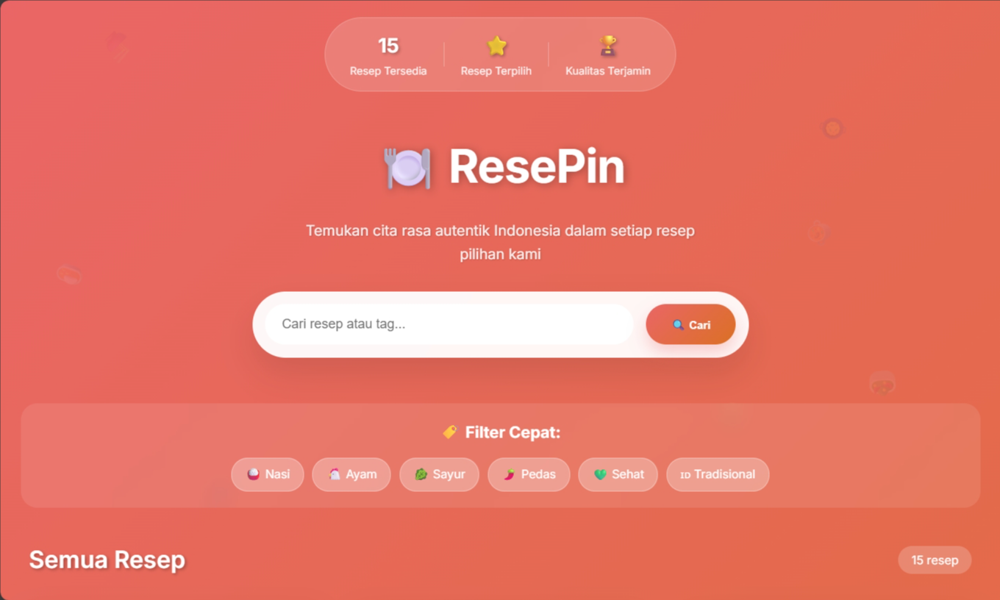
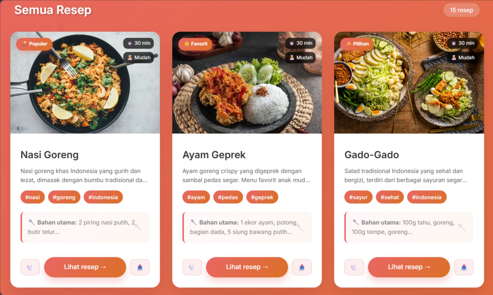
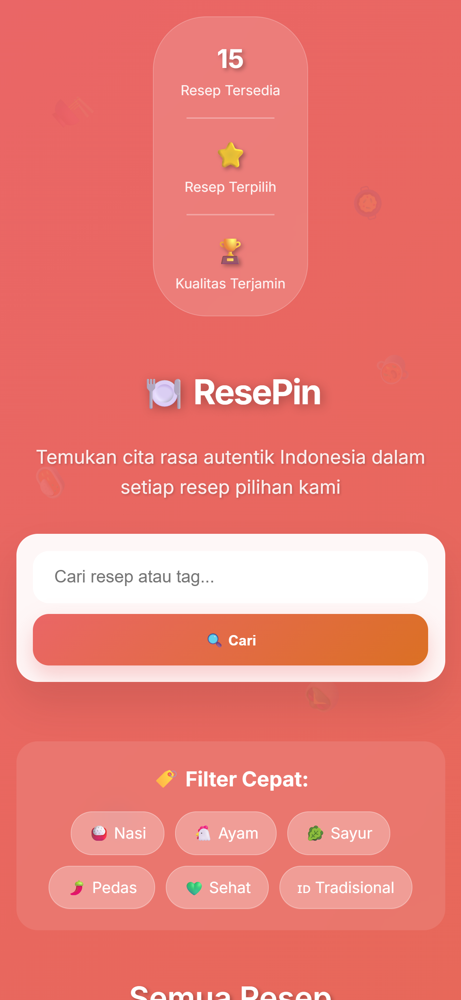
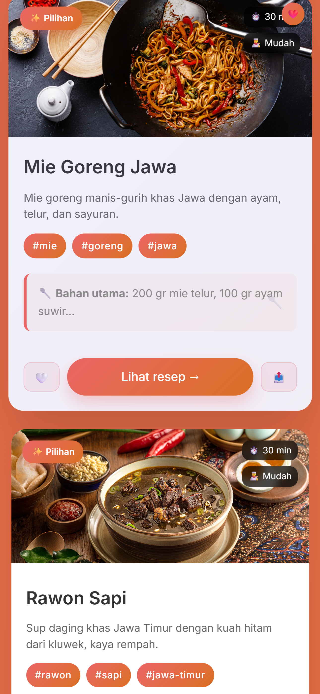
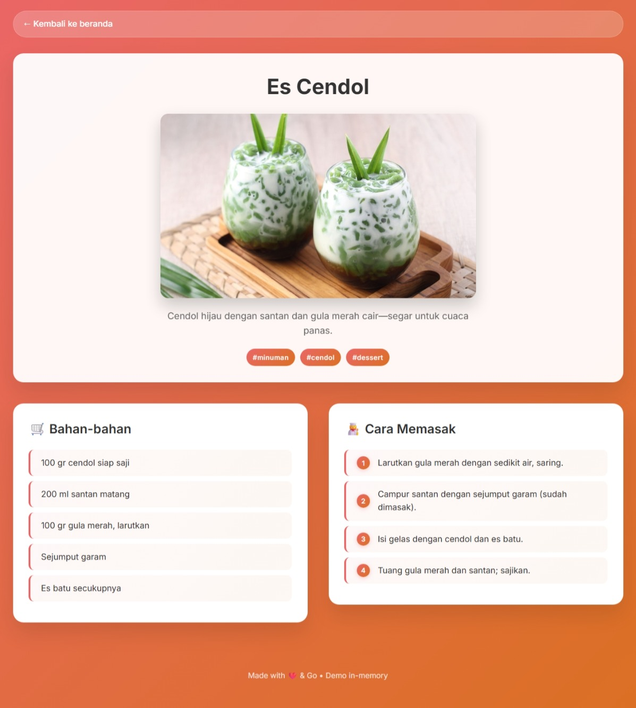
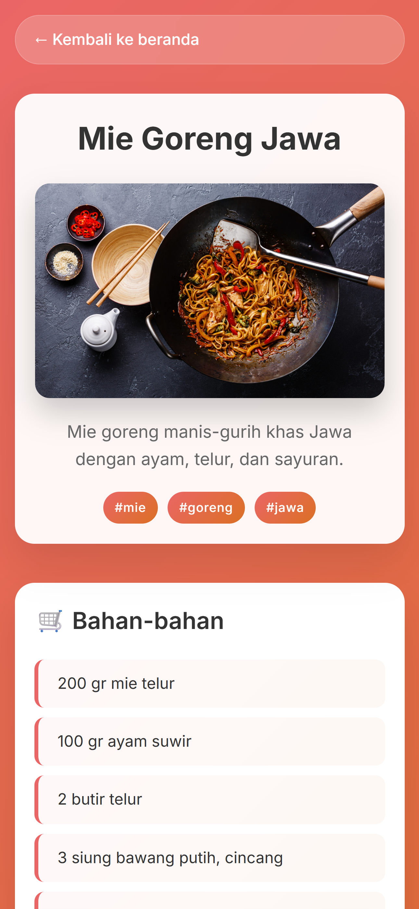
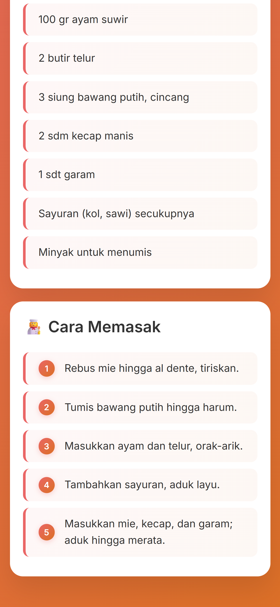

# ResePin 🍳

**ResePin** is a web application built with **Go** that showcases a collection of Indonesian recipes. Users can browse, search, and view detailed instructions for various traditional dishes. This project is designed to be simple, fast, and easy to deploy.

---

## 📝 Repository Description

This repository contains a Go-based web application called **My-Recipe**, which serves as a digital cookbook. It includes:

- A variety of Indonesian recipes with names, descriptions, ingredients, instructions, and images.
- Organized folder structure for templates, static files (CSS, JS, images), and internal Go modules.
- Go `net/http` server implementation.
- Modularized code using handlers and services for better maintainability.
- Ready-to-deploy setup for platforms like **Vercel** or **Netlify** (with Go build support).

---

## 🚀 Features

- Browse all recipes
- View recipe details including ingredients and instructions
- Static assets support for images, CSS, and JS
- Simple and clean UI

---

## 📸 Screenshots
### 🏠 Main Page

  
  
  
  

---
### 🔍 Detail Recipe

  
  
  

---

## 👩‍💻 About the Developer

By **Dewi Atika Muthi**  
📍 _Informatics Student, Telkom University_  
📧 **Email:** detikaa10@gmail.com  
🌐 **GitHub:** [@tikature](https://github.com/tikature)  

💬 *"Design with simplicity, build with purpose."*

